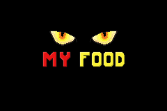

# MY FOOD

## Description

Your food was robbed by another cat and you do the most logical thing to do, follow the robber trouogh portals until you achieve your food back.

## History

The game started while I was triying to improve my skills in game development. To do that, I went to TIC-80 since it's easier and you can do all the things for your game in one software, and I also like the aesthetics. I did a lot of things in this fantasy console but had a block triyng to do some mechanics that I wanted in the game. So, after a lot of time triyng to understand what I was wrong, I decided to switch the game development to the Godot Engine.

A lot of things became easier to do and I was able to develop all the mechanics that I wanted, including the cutscenes. I really like 8bit Pixel Art and Chiptune, so the game will have those aesthetics. All the sprites, tiles, music and sfxs are made by me, Tomaz Mota, and I will be signing as Cat in a Chip, a persona that I created to compose chiptune music.
